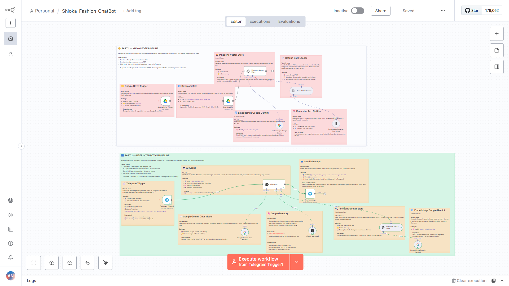

<div align="center">


# Shloka Fashion ChatBot

**AI customer support bot — n8n · Gemini · Pinecone · Telegram**

> ⚠️ Shloka Fashion is a dummy brand — built purely for learning and demonstration

[](LICENSE)
[](https://n8n.io)
[](https://github.com/Abhishek88788/Shloka_Fashion_ChatBot)


</div>

---

Small startups lose customers every day because no one is available to answer questions at 2AM. This is my attempt to fix that — a RAG-powered Telegram bot that reads your own PDF and answers from it. No hallucinations. No wrong answers. Just your docs, made conversational.

---

## How it works



Two pipelines. One for feeding knowledge, one for talking to users.

### Part 1 — Knowledge Pipeline


Drop a PDF into a Google Drive folder → pipeline auto-triggers → splits, embeds and stores everything in Pinecone. Next time a customer asks something, the answer is already there.

### Part 2 — User Interaction Pipeline


Customer messages the Telegram bot → AI Agent searches the knowledge base → Gemini composes a clean reply → sent back to that exact user. Memory is per-user so follow-up questions work too.

---

## Stack

| Tool | Role |
|---|---|
| n8n | Workflow automation |
| Google Gemini | LLM + embeddings |
| Pinecone | Vector database |
| Telegram | User interface |
| Google Drive | Knowledge base storage |

---

## Get it running

```bash
git clone https://github.com/Abhishek88788/Shloka_Fashion_ChatBot.git
```

1. Import `Shloka_Fashion_ChatBot.json` into n8n
2. Add credentials — Telegram, Gemini, Pinecone, Google Drive
3. Create a Pinecone index `n8n-rag` — 3072 dimensions, cosine metric
4. Upload your PDF to a Google Drive folder
5. Activate the workflow — done

> **Local testing?** Telegram needs a public HTTPS URL
> ```
> ngrok http 5678
> set WEBHOOK_URL=https://your-ngrok-url.ngrok-free.app && n8n start
> ```

Every node inside the workflow has a sticky note — open any node to read what it does, what to change, and what to watch out for.

---

## Make it yours

Swap the PDF with your own brand's policies, FAQs or product info. Drop it in the Drive folder — bot updates itself. No re-setup, no re-configuration.

Works for any small business with repetitive customer questions.

---

## License

MIT — use it, modify it, ship it.

---

<div align="center">

Built by <a href="https://github.com/Abhishek88788">@Abhishek88788</a>

Got stuck? Check the full breakdown on LinkedIn → [View Post](https://www.linkedin.com/posts/abhishek-nishad-dev_n8n-rag-aiautomation-activity-7436618017435856896-ubMV?utm_source=share&utm_medium=member_desktop&rcm=ACoAAD4OpCkBEjk00gYfn6r6jgkULhVD21_KNtQ)

</div>
